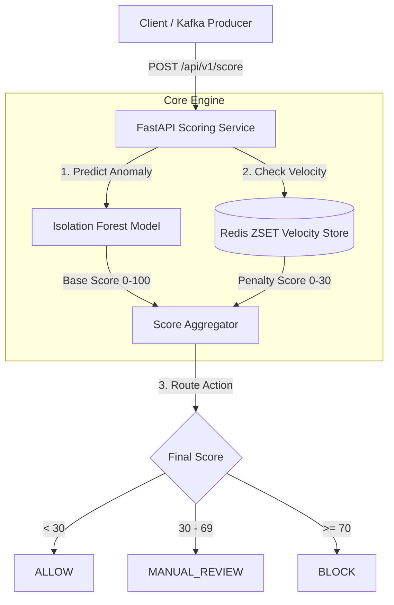

# 🛡️ Real-Time Transaction Fraud Detection Radar

An end-to-end, high-throughput real-time fraud detection engine (inspired by **Stripe Radar**). It combines an unsupervised **Scikit-Learn Isolation Forest** anomaly model, a **Redis** sliding-window velocity tracker, an ultra-fast **FastAPI** scoring microservice, **Kafka** event streaming, and a **minimal web dashboard**.

---

## 📐 System Architecture



---

## 🔬 Core Components & Code Explanation

### 1. Unsupervised Machine Learning Model (`app/services/anomaly_detector.py`)

**What is happening & Why:**
Fraudulent transactions are rare outliers that deviate significantly from standard baseline behavior. We use an **Isolation Forest** trained exclusively on normal transaction patterns ($V_1 \dots V_{28}$ PCA features + transaction amount). 

Because the raw Isolation Forest `decision_function()` returns unbounded values (where positive values mean normal and negative values indicate anomalies), we apply a **smooth sigmoid transformation** to calibrate raw scores into an intuitive **0 to 100 risk score**.

```python
# Extract features and scale using fitted StandardScaler
full_vector = np.array(feature_vector + [float(amount)], dtype=np.float64).reshape(1, -1)
scaled_vector = self.scaler.transform(full_vector)

# Raw IsolationForest decision_function: higher = normal, lower/negative = anomaly
raw_score = float(self.model.decision_function(scaled_vector)[0])

# Calibrate raw score into 0-100 risk score via sigmoid transformation
risk_score = 100.0 / (1.0 + np.exp(14.0 * (raw_score - 0.01)))
risk_score = float(np.clip(risk_score, 0.0, 100.0))
```

---

### 2. Redis Sliding-Window Velocity Engine (`app/services/velocity_checker.py`)

**What is happening & Why:**
Fraudsters frequently attempt rapid card testing or high-volume spending sprees. To detect rapid repetition within tight time windows without database bottlenecks, we leverage **Redis Sorted Sets (ZSETs)** with Unix timestamps as scores.

We execute atomic pipeline operations:
1. Prune expired entries outside the sliding window (`ZREMRANGEBYSCORE`).
2. Record the current transaction ID and timestamp (`ZADD`).
3. Count transactions in the 10-minute window (`ZCARD`) and sum spending in the 1-hour window.

```python
# Redis ZSET atomic pipeline for 10-minute count & 1-hour spend checks
async with r.pipeline(transaction=True) as pipe:
    # 1. Clean old entries outside windows
    pipe.zremrangebyscore(key_count, 0, window_10m_start)
    pipe.zremrangebyscore(key_amount, 0, window_1h_start)

    # 2. Record current transaction
    pipe.zadd(key_count, {txn_id: now})
    pipe.zadd(key_amount, {f"{txn_id}:{amount}": now})

    # 3. Fetch count in 10-minute window & items in 1-hour window
    pipe.zcard(key_count)
    pipe.zrangebyscore(key_amount, window_1h_start, "+inf")

    results = await pipe.execute()
```

---

### 3. FastAPI Scoring Microservice (`app/routers/score.py`)

**What is happening & Why:**
The scoring endpoint orchestrates the evaluation pipeline in parallel under 5 milliseconds. It aggregates the ML base score and Redis velocity penalty score, evaluates reason flags, and maps the combined score to an actionable decision (`ALLOW`, `MANUAL_REVIEW`, `BLOCK`).

```python
@router.post("/score", response_model=ScoreResponse)
async def score_transaction(payload: TransactionPayload) -> ScoreResponse:
    start_time = time.perf_counter()

    # 1. Evaluate Base ML Anomaly Score (0-100)
    model_score, model_reasons = anomaly_detector.predict(payload.features, payload.amount)

    # 2. Evaluate Redis Velocity Penalty (0-30)
    velocity_score, velocity_reasons, _ = await velocity_checker.check_and_update(
        card_id=payload.card_id, txn_id=payload.transaction_id, amount=payload.amount
    )

    # 3. Combine scores & map to decision action
    combined_score = int(round(min(100.0, model_score + velocity_score)))
    
    if combined_score < settings.ALLOW_THRESHOLD:
        action = ActionEnum.ALLOW
    elif combined_score <= settings.REVIEW_THRESHOLD:
        action = ActionEnum.MANUAL_REVIEW
    else:
        action = ActionEnum.BLOCK

    elapsed_ms = (time.perf_counter() - start_time) * 1000.0
    return ScoreResponse(..., risk_score=combined_score, action=action, latency_ms=elapsed_ms)
```

---

### 4. Embedded Minimal Web Dashboard (`app/static/`)

**What is happening & Why:**
To provide an interactive demonstration of the engine, a minimal web application (inspired by Claude's clean, editorial UI layout with custom Nordic Emerald aesthetics) is mounted at `/`.

- **Scenario Presets**: Pre-fills inputs for *Safe Purchase*, *Rapid Velocity*, and *Extreme Anomaly*.
- **Interactive Risk Gauge**: Displays an animated radial meter (0–100), ML vs Velocity score breakdowns, and latency metrics.
- **Live Stream Simulator**: Simulates real-time transaction traffic and updates a scrolling audit table.

---

## ⚡ Quick Start Guide

### Option 1: Direct Python Execution

1. **Install Dependencies**:
   ```bash
   pip install -r requirements.txt
   ```

2. **Train / Load Model Artifacts**:
   ```bash
   python scripts/train_model.py
   ```

3. **Start FastAPI Application**:
   ```bash
   python -m uvicorn app.main:app --reload --port 8000
   ```

4. **Open Web Dashboard**:
   Navigate to [http://127.0.0.1:8000](http://127.0.0.1:8000) in your browser.

---

### Option 2: Docker Compose (Full Stack with Kafka & Redis)

Launch all microservices (Zookeeper, Kafka, Redis, FastAPI, Stream Consumer):

```bash
docker-compose up --build
```

- **Dashboard**: [http://localhost:8000](http://localhost:8000)
- **API Documentation**: [http://localhost:8000/docs](http://localhost:8000/docs)
- **Health Monitoring**: [http://localhost:8000/health](http://localhost:8000/health)

---

## 🧪 Testing

Run the automated test suite with pytest:

```bash
py -m pytest tests/
```

```text
tests\test_api.py ......                                                  [ 83%]
tests\test_velocity.py .                                                 [100%]
======================== 6 passed in 16.17s ========================
```
